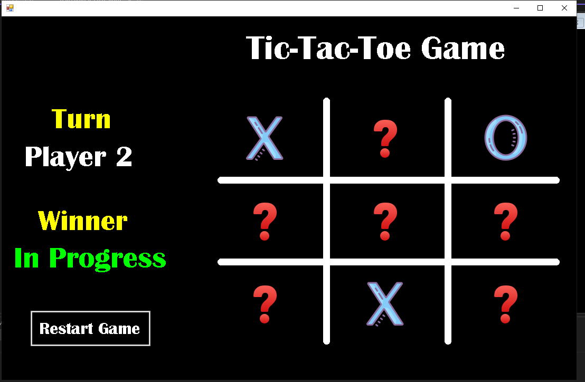

# ❌⭕ Tic-Tac-Toe Game

A two-player Tic-Tac-Toe (XO) desktop game built with C# and Windows Forms, featuring image-based X and O pieces, win detection, draw detection, and a restart option.

---

## 📖 Overview

Tic-Tac-Toe Game is a desktop application built with C# and Windows Forms. Two players take turns clicking on a 3×3 grid to place their X or O. The game detects wins across all rows, columns, and diagonals, highlights the winning combination in green, and announces the result. A restart button resets the board for a new game.

---

## 🖼️ Screenshot



---

## ✨ Features

- **Two-Player Mode**: Player 1 plays X, Player 2 plays O
- **Image-Based Pieces**: X and O are displayed as images loaded from project resources
- **Turn Indicator**: Label updates after each move to show whose turn it is
- **Win Detection**: Checks all 8 winning combinations (3 rows, 3 columns, 2 diagonals)
- **Win Highlight**: Winning buttons turn green to visually indicate the winning line
- **Draw Detection**: Detects a draw when all 9 cells are filled with no winner
- **Invalid Move Alert**: Shows an error message if a player clicks an already-filled cell
- **Game Over Dialog**: MessageBox announces the end of the game
- **Restart Button**: Resets the board, scores, and turn indicator back to initial state
- **Custom Grid Drawing**: Grid lines drawn using GDI+ in the `Form1_Paint` event

---

## 🎮 How to Play

1. Run the application.
2. Player 1 (X) clicks any cell on the 3×3 grid.
3. Player 2 (O) clicks any empty cell.
4. Players alternate turns until someone wins or the board is full.
5. The winning line highlights in green and a Game Over dialog appears.
6. Click **Restart** to play again.

---

## 🧠 Concepts Used

- **Windows Forms (WinForms)** — Desktop GUI built using C# WinForms components
- **Enums** — `enPlayer` (Player1, Player2) and `enWinner` (Player1, Player2, Draw, GameInProgress) for clean state management
- **Structs** — `stGameStatus` holds `Winner`, `GameOver`, and `PlayCount` as a game state container
- **Event-Driven Programming** — Each button click triggers a move and winner check
- **GDI+ Drawing** — Grid lines drawn using `Graphics.DrawLine()` with a custom `Pen` in `Form1_Paint`
- **Image Resources** — X, O, and question mark images loaded from project Resources
- **Button Tags** — Cell state ("X", "O", "?") stored in button `Tag` property
- **State Management** — Game state tracked via `stGameStatus` struct and `enPlayer` enum

---

## 🔑 Key Methods

| Method | Description |
|---|---|
| `ChangeImage()` | Handles a player's move — updates image, tag, turn, and checks winner |
| `CheckValues()` | Checks if three buttons share the same non-empty tag value |
| `CheckWinner()` | Calls `CheckValues()` for all 8 winning combinations |
| `EndGame()` | Updates the winner label and shows the Game Over dialog |
| `RestartGame()` | Resets all buttons, labels, and game state for a new round |
| `RestButton()` | Resets a single button to its default question mark state |
| `Form1_Paint()` | Draws the grid lines using GDI+ |

---

## 🏗️ Project Structure

```
p18-Tic-Tac-Toe-Game/
│
├── Form1.cs              # Main game logic and event handlers
├── Form1.Designer.cs     # Auto-generated UI layout
├── Program.cs            # Application entry point
├── Images/               # Game images folder
├── Resources/            # Project resources (X, O, question mark images)
├── res/                  # Additional resources
├── XO-Game-Final.sln     # Visual Studio solution file
└── README.md
```

---

## ⚙️ Requirements

- **IDE**: Visual Studio 2019 or later
- **Framework**: .NET Framework (Windows Forms)
- **OS**: Windows

---

## 📄 License

This project is open source and free to use for educational purposes.

---

## 👤 Author

👤 **Mahmoud Abd El-Sattar**  
📧 mahmoud.abdelsattar.dev@gmail.com  
💼 [linkedin.com/in/mahmoud-abd-el-sattar](https://www.linkedin.com/in/mahmoud-abd-el-sattar-1b227522a)
